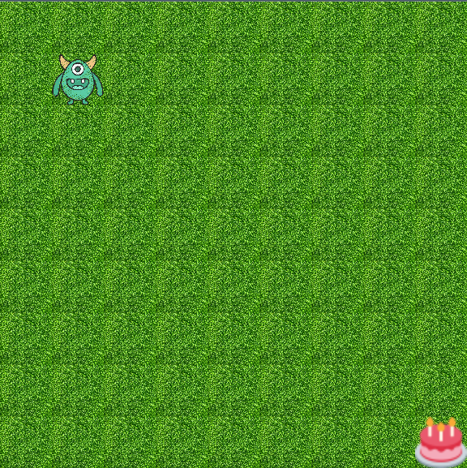

<h1 align="center"> Sobre o repositório </h1>

Esse repositório contém uma atividade desenvolvida durante a aula inaugural do curso de Desenvolvimento de Software - Foco em Backend da [CubosAcademy](https://cubos.academy/)

##O jogo

Clássico e divertido o mini game tem uma estrutura minimalista, controlado pelas setas. 
O nosso simpatico monstrinho quer comer bolo! 

